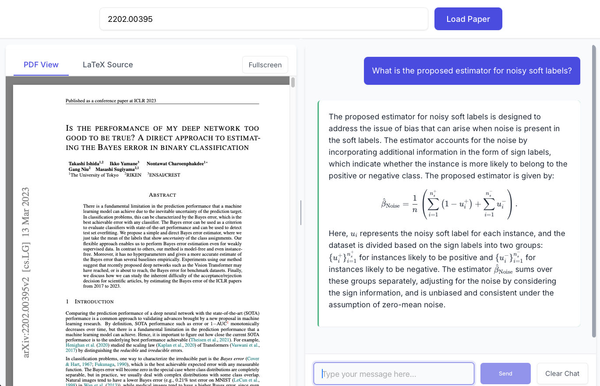

# arxiv-tex-ui

A web app for understanding and interacting with equation-heavy arXiv papers.



Many PDF chat applications often struggle with mathematical content and equation heavy papers.
By utilizing the original LaTeX source code from arXiv papers, the backend llm can accurately understand and handle equations/notations.
Particularly valuable for fields like computer science, mathematics, and engineering.

### Features

- Load papers from arXiv by ID
- View PDF papers
- Extract LaTeX source with [arxiv-to-prompt](https://github.com/takashiishida/arxiv-to-prompt)
- Chat with AI about the paper content
- Streaming chat responses for a better UX
- Math rendering with KaTeX for beautiful equations

### Installation and running the App

The project requires Node.js and Python.

The backend requires the `arxiv-to-prompt` Python package:

```bash
pip install arxiv-to-prompt
```

Set the OPENAI_API_KEY environment variable before starting the server:

```bash
# On macOS/Linux
export OPENAI_API_KEY=sk-your-api-key-here
# On Windows
set OPENAI_API_KEY=sk-your-api-key-here
```

To build and start the app, run:

```bash
npm install
npm run start
```
